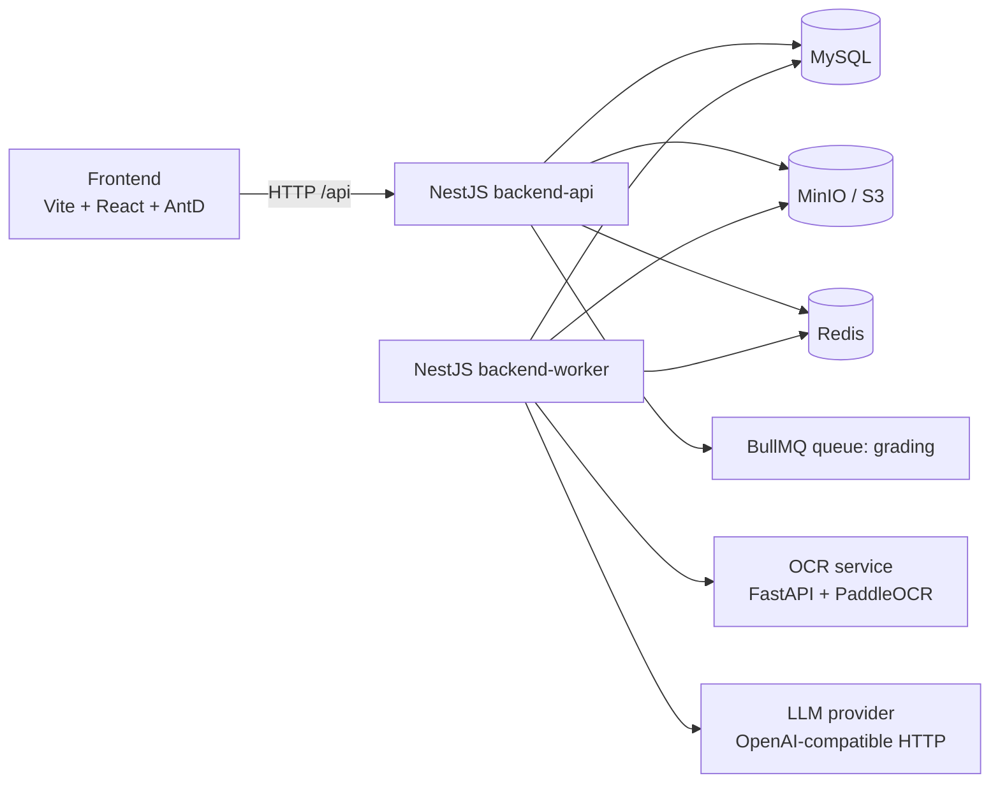
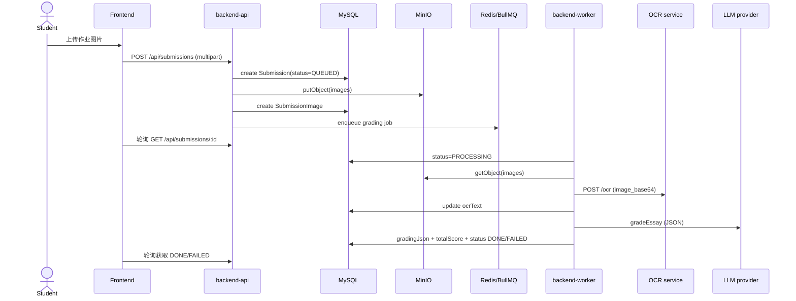
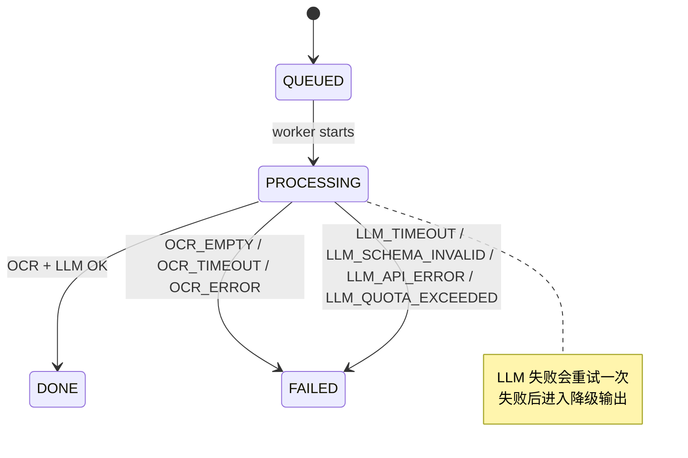

# 项目概览（Homework AI）

TL;DR
- 这是一个“作业图片 -> OCR -> LLM 结构化批改”的全链路系统，含前端、后端 API、异步 worker、OCR 服务、对象存储与队列。
- 角色分为 Student/Teacher/Admin，权限在 API 层通过 JWT + RBAC 控制。
- 异步批改流程已落地：上传 -> 入队 -> OCR -> LLM -> DONE/FAILED，并支持预算降级与错误码。

Last updated: 2026-01-24

## 1) 产品简介与角色权限
系统目标：学生提交手写作业图片，服务端完成 OCR + LLM 批改，前端轮询展示结果。

角色与权限（基于 `Role` 枚举与控制器权限）：
- Student：提交作业、查看自己的 submission、查看学生端作业/报告页面。
- Teacher：管理班级与作业、查看班级内学生提交、查看班级报表（API 已有，前端待接入）。
- Admin：拥有教师能力 + 管理员专属接口（Retention 清理手动触发）。
说明：`POST /api/auth/register` 当前允许传 `role` 字段且未受保护，默认视为开发阶段行为。

权限校验入口：`apps/backend/src/auth/*`, `apps/backend/src/*/*.controller.ts` 中的 `@Roles` 与 `JwtAuthGuard/RoleGuard`。

## 2) 已实现阶段（Phase A/B/C/D/E）
以下阶段按代码实际实现归纳（非文档臆测）：

- Phase A（基础脚手架）
  - Monorepo + pnpm workspaces：`package.json`, `pnpm-workspace.yaml`
  - 基础 API + 健康检查：`apps/backend/src/health/health.controller.ts`
  - BullMQ demo 队列：`apps/backend/src/queue/queue.controller.ts`, `apps/backend/src/queue/queue.service.ts`
  - Docker Compose 基础设施：`deploy/docker-compose.yml`

- Phase B（Auth/JWT/RBAC + 教师/班级/作业）
  - JWT 登录/注册：`apps/backend/src/auth/*`
  - 角色权限：`Role` enum + `@Roles` 守卫
  - 班级管理与导入学生：`apps/backend/src/classes/*`
  - 作业管理：`apps/backend/src/homeworks/*`

- Phase C（提交上传 + 存储 + 队列）
  - 学生端上传 1-3 张图片：`apps/backend/src/submissions/submissions.controller.ts`
  - MinIO 对象存储：`apps/backend/src/storage/storage.service.ts`
  - 关键 objectKey 规则：`submissions/{submissionId}/{uuid}.jpg`
  - 提交后入队 `grading`：`apps/backend/src/queue/queue.service.ts`

- Phase D（OCR 服务对接）
  - OCR 服务 FastAPI + PaddleOCR：`services/ocr-service/main.py`
  - Worker 下载图片 -> OCR -> 写入 `ocrText`：`apps/backend/src/worker/grading.processor.ts`

- Phase E（LLM 批改：结构化 JSON + 预算 + 降级）
  - LLM Provider 抽象 + OpenAI 兼容请求：`apps/backend/src/grading/providers/cheap.provider.ts`
  - JSON Schema 校验：`apps/backend/src/grading/schemas/gradingResult.schema.json`
  - AJV 校验与失败重试/降级：`apps/backend/src/grading/grading.service.ts`, `apps/backend/src/grading/utils/schema-validate.ts`
  - 预算保护：`apps/backend/src/grading/utils/budget.ts`
  - 前端结果展示：`apps/frontend/src/pages/student/SubmissionResult.tsx`

## 3) 架构与数据流

### 3.1 组件关系图


### 3.2 核心提交流程（时序）


### 3.3 Submission 状态机


## 4) 关键数据模型（Prisma）
文件：`apps/backend/prisma/schema.prisma`
- `User`：`role`, `account`, `name`
- `Class` / `Enrollment`：班级与学生关系
- `Homework`：作业基础信息
- `Submission`：`status`, `ocrText`, `gradingJson`, `totalScore`, `errorCode`
- `SubmissionImage`：提交图片对象 Key

## 5) 前端页面与路由
路由入口：`apps/frontend/src/routes/router.tsx`
- `/login`：登录页
- `/student/*`：学生端（作业列表、提交、提交结果、报告）
- `/teacher/*`：教师端（班级、作业、提交详情、报告）
- `/admin/*`：管理员配置（占位）

主要页面文件：
- 学生端：`apps/frontend/src/pages/student/Homeworks.tsx`, `SubmitHomework.tsx`, `SubmissionResult.tsx`, `Report.tsx`
- 教师端：`apps/frontend/src/pages/teacher/Classes.tsx`, `Homeworks.tsx`, `SubmissionDetail.tsx`, `Report.tsx`
- 管理员：`apps/frontend/src/pages/admin/Config.tsx`

## 6) 后端模块与关键流程
模块入口：`apps/backend/src/app.module.ts`
- `AuthModule`：JWT 登录/注册 + RBAC
- `ClassesModule`, `HomeworksModule`, `SubmissionsModule`
- `QueueModule`：BullMQ 入队
- `RetentionModule`：7 天清理（定时 + 手动）
- `ReportsModule`：教师报表与导出（CSV）
  - 队列 job 类型：`demo`, `grading`, `regrade`（见 `apps/backend/src/queue/queue.service.ts`）

Worker：`apps/backend/src/worker/grading.processor.ts`
- 订阅 BullMQ `grading` 队列
- 状态流转：`QUEUED -> PROCESSING -> DONE/FAILED`
- OCR 与 LLM 批改链路

## 7) 配置与环境变量（按代码读取）
环境变量入口：`apps/backend/.env.example`, `apps/frontend/.env.example`。

后端（读取位置）：
- `DATABASE_URL`（Prisma）：`apps/backend/prisma/schema.prisma`
- `JWT_SECRET`（JWT）：`apps/backend/src/auth/auth.module.ts`
- `REDIS_URL`（BullMQ/预算）：`apps/backend/src/app.module.ts`, `apps/backend/src/worker/worker.module.ts`, `apps/backend/src/grading/utils/budget.ts`
- MinIO：
  - `MINIO_ENDPOINT`, `MINIO_ACCESS_KEY`, `MINIO_SECRET_KEY`, `MINIO_BUCKET`, `MINIO_REGION`
  - 读取：`apps/backend/src/storage/storage.service.ts`
- OCR：
  - `OCR_BASE_URL`, `OCR_TIMEOUT_MS`
  - 读取：`apps/backend/src/worker/grading.processor.ts`
- LLM：
  - `LLM_BASE_URL`, `LLM_API_KEY`, `LLM_MODEL`, `LLM_MODEL_CHEAPER`, `LLM_MODEL_QUALITY`
  - `LLM_MAX_TOKENS`, `LLM_TEMPERATURE`, `LLM_TIMEOUT_MS`, `LLM_MAX_INPUT_CHARS`
  - `LLM_PROVIDER`, `LLM_PROVIDER_NAME`
  - 读取：`apps/backend/src/grading/providers/cheap.provider.ts`, `apps/backend/src/grading/grading.service.ts`
- 预算：
  - `LLM_DAILY_CALL_LIMIT`, `BUDGET_MODE`
  - 读取：`apps/backend/src/grading/utils/budget.ts`
- Worker：
  - `WORKER_CONCURRENCY`：`apps/backend/src/worker/grading.processor.ts`
- Retention：
  - `RETENTION_DAYS`, `RETENTION_DRY_RUN`, `RETENTION_BATCH_SIZE`, `RETENTION_CRON`, `RUN_RETENTION`
  - 读取：`apps/backend/src/retention/retention.service.ts`
- `PORT`：`apps/backend/src/main.ts`

前端：
- `VITE_API_BASE_URL`：`apps/frontend/src/api/index.ts`

Docker Compose override：
- `deploy/docker-compose.yml` 覆盖 `DATABASE_URL`, `REDIS_URL`, `MINIO_ENDPOINT`, `OCR_BASE_URL`, `RUN_RETENTION`, `PORT`

## 8) 运行方式

### 推荐开发模式（基础设施容器 + 本地服务）
```bash
# 基础设施 (MySQL/Redis/MinIO/OCR)
cd deploy
docker compose up mysql redis minio ocr-service
```

```bash
# 安装依赖
pnpm install

# Prisma Client
pnpm --filter backend prisma:generate

# 后端 API
pnpm run dev:backend

# Worker
pnpm run dev:worker

# 前端
pnpm run dev:frontend
```

### 纯 Docker Compose（一键全栈）
```bash
cd deploy
docker compose up --build
```

### 快速验证
- 健康检查：`GET http://localhost:3000/api/health`
- 提交作业：学生端上传 1-3 张图片
- 观察状态：前端轮询 `QUEUED -> PROCESSING -> DONE/FAILED`

## 9) API 面
全局前缀：`/api`（见 `apps/backend/src/main.ts`）。

Auth
- `POST /api/auth/register`：注册账号（含 role 字段，公开）
- `POST /api/auth/login`：登录获取 JWT
- `GET /api/auth/me`：验证登录态（JWT）

Classes（Teacher/Admin）
- `POST /api/classes`：创建班级
- `GET /api/classes`：班级列表
- `POST /api/classes/:id/students/import`：导入学生
- `GET /api/classes/:id/students`：班级学生列表

Homeworks
- `POST /api/homeworks`（Teacher/Admin）：创建作业
- `GET /api/homeworks?classId=...`（Teacher/Admin）：作业列表
- `GET /api/homeworks/student`（Student）：学生作业列表

Submissions
- `POST /api/submissions`（Student）：上传作业图片
- `GET /api/submissions/:id`（Student/Teacher/Admin）：查询提交
- `POST /api/submissions/:id/regrade`（Student/Teacher/Admin）：重新批改入队

Reports（Teacher/Admin）
- `GET /api/teacher/reports/class/:classId/overview?days=7&topN=5`
- `GET /api/teacher/reports/class/:classId/export?days=7`（CSV）
- `GET /api/teacher/reports/student/:studentId/overview?days=7`

Retention（Admin）
- `POST /api/admin/retention/run`：手动清理（支持 `dryRun`）

Queue demo（无鉴权）
- `POST /api/queue/demo`：入队 demo job

OCR service（独立服务）
- `POST /ocr`：接收 `image_url` 或 `image_base64`，返回 `{ text, confidence }`
- `GET /health`

## 10) 状态与错误码
Submission 状态：`QUEUED | PROCESSING | DONE | FAILED`（见 `apps/backend/prisma/schema.prisma`）

OCR 错误码（worker 设置）：
- `OCR_EMPTY`, `OCR_TIMEOUT`, `OCR_ERROR`

LLM 错误码（grading service/worker）：
- `LLM_TIMEOUT`, `LLM_SCHEMA_INVALID`, `LLM_API_ERROR`, `LLM_QUOTA_EXCEEDED`

降级/预算行为：
- LLM 首次失败会重试一次（降低 maxTokens 或启用严格 JSON）。
- 输入过长或预算超额（soft）会触发降级：短输出、低档建议。
- 预算超额（hard）直接 `FAILED`。
  - 预算计数 Key：`llm:calls:YYYYMMDD`（Redis）

## 11) 代码地图（关键实现路径）
- Grading：`apps/backend/src/grading/grading.service.ts`
- Schema 校验：`apps/backend/src/grading/utils/schema-validate.ts`
- 预算：`apps/backend/src/grading/utils/budget.ts`
- JSON Schema：`apps/backend/src/grading/schemas/gradingResult.schema.json`
- LLM Provider：`apps/backend/src/grading/providers/cheap.provider.ts`
- Worker 流程：`apps/backend/src/worker/grading.processor.ts`
- 存储：`apps/backend/src/storage/storage.service.ts`
- 提交：`apps/backend/src/submissions/submissions.controller.ts`, `apps/backend/src/submissions/submissions.service.ts`
- 前端结果页：`apps/frontend/src/pages/student/SubmissionResult.tsx`
- 前端 API 封装：`apps/frontend/src/api/index.ts`
- OCR 服务：`services/ocr-service/main.py`

## 12) 运行约束与运维
- 数据保留上限 7 天已实现（定时 + 手动触发）：
  - 逻辑：`apps/backend/src/retention/retention.service.ts`
  - 手动接口：`POST /api/admin/retention/run`
  - 脚本：`scripts/retention/verify-retention.ps1`
  - 仅 `RUN_RETENTION=true` 的进程会执行 cron
- 并发目标（1000 在线/5000 账号）未做压测，暂无性能数据。

## 13) Roadmap / TODO（基于当前代码）
- Phase F（报表/导出）：
  - 后端 API 与 CSV 已实现（`apps/backend/src/reports/*`）
  - 前端教师/学生报告页仍为占位（`apps/frontend/src/pages/*/Report.tsx`）
  - PDF 导出未实现
- Phase G（7 天保留清理）：
  - cron + 手动接口 + MinIO 删除已实现
  - 需在部署环境设置 `RUN_RETENTION=true` 给 `backend-api`
- 其他缺口：
  - `TeacherSubmissionDetailPage` 与报表未连接实际 API
  - `AdminConfigPage` 当前为 UI 占位
  - `LLM_DAILY_TOKEN_LIMIT` 仅存在于 `.env.example`，暂无 token 级别预算统计
